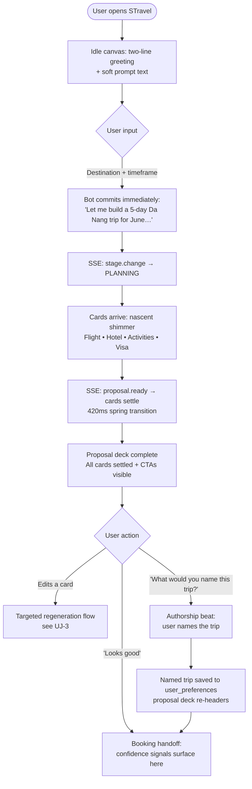
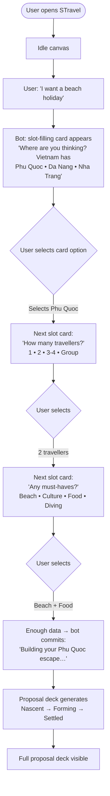
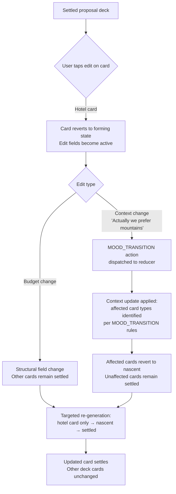
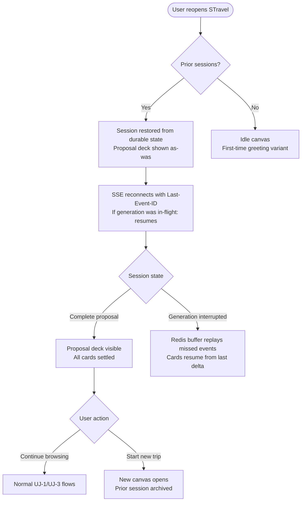
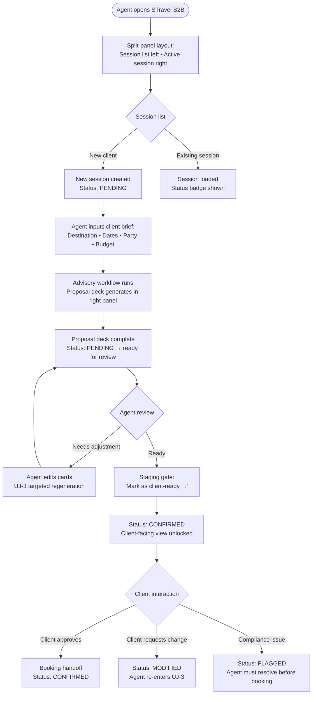

# UX Design Specification — STravel

**Author:** Fred
**Date:** 2026-05-25

---

<!-- UX design content will be appended sequentially through collaborative workflow steps -->

## Executive Summary

### Project Vision

STravel replaces a 12-field static form with a conversational AI advisor that leads the user. Core design principle: **the bot has an opinion — the user's job is to refine it, not create from scratch.** The interface must feel like texting a knowledgeable travel friend, not filling out a government form.

### Target Users

**Primary — Self-Serve Traveler (B2C)**
Mobile-first, 25–45 years old. Casual browser on a phone. Low patience for upfront effort. Familiar with chat interfaces. Wants to arrive at a credible plan fast without thinking through logistics. Starts travel planning with *desire*, not dates — the mood-first entry responds directly to this.

**Secondary — Travel Agent Copilot (B2B)**
Desktop-first professional, on a client call. Needs structured intake speed. Critically: the agent is *being watched by their client* — the UX must support professional credibility, not undermine it. A clunky AI typing indicator in front of a client is worse than no AI at all.

**Underserved (flagged for design): Returning User**
Both personas above are first-touch journeys. The returning B2C traveler refining a trip, and the agent reopening a saved client session, represent distinct interaction needs not yet addressed in the PRD. The "living document" opportunity depends on this being designed explicitly.

### Key Design Challenges

1. **Legibility of intent, not just pacing.** Sequential questions feel like interrogation not because there are many, but because each arrives without context for *why* it's being asked. This is a copywriting and reasoning-transparency challenge as much as a UX structure problem.

2. **Card component architecture.** 10+ card types risk becoming a maintenance trap without a shared streaming card envelope (`type` discriminator + `completeness_score`). Each card must answer one question at a glance — designed for a *glance*, not a *read*.

3. **Recovery path design.** What happens when Propose-First produces a wrong result and the user wants to restart with cards? What when a user abandons at step two — is state saved? These recovery paths are absent from the current PRD and must be designed explicitly.

4. **Streaming card protocol.** SSE delivers text deltas, not structured card payloads. The threshold logic for "when is a card complete enough to render?" must be defined before individual card types are designed — not left as an implementation detail.

5. **The handoff moment.** When does the conversation end and a booking decision begin? Chat interfaces create psychological unreadiness to commit. This transition needs the design equivalent of a checkout button's finality — it doesn't happen by default.

### Design Opportunities

1. **Mood-first as emotional differentiation** *(high potential, high execution risk)* — No competitor leads with emotional state as primary intake. Genuinely hard to copy. Only works if the AI demonstrably uses the mood signal to shape recommendations. If it doesn't, users feel manipulated.

2. **Proposal card deck as editable draft** *(real differentiator in the editing layer)* — Cards solve the archaeology problem (critical data buried in scroll). The living/editable dimension is where the real differentiation lives, not the card format itself. "Living" needs specificity: what can be edited, regenerated, compared, or shared?

3. **Honest transparency over narration** *(table stakes done well)* — Stage indicators are expected by users trained on ChatGPT and Perplexity. The differentiator is narrative quality: *"Curating experiences for your group"* vs. filler text. Honest and specific beats warm and vague every time.

### Party Mode Key Findings *(folded from Sally · John · Winston · Mary)*

- **Entry path is a state, not a routing decision** *(Sally)*: Propose-First and Card-Guided may be mood states of the same user, not separate user types. The design should allow fluid register-shifting, not commit the user to a path.
- **Recovery paths are missing** *(John + Sally)*: What does the user lose on abandon? What's the graceful handoff when card-only completion fails?
- **Streaming card protocol is a pre-design prerequisite** *(Winston)*: Define the shared card envelope and completeness thresholds before designing individual card types. The budget slider is a special case — interactive input with potential 60s re-generation latency, not a read-only render.
- **B2B stakeholder map is incomplete** *(Mary)*: The travel agency business (data privacy, booking system integration, audit trails) has veto power over adoption even if individual agents love the UX.
- **Vietnam-specificity is underleveraged** *(Mary)*: Local knowledge, visa complexity, and regional nuance should be explicit design inputs, not generic travel AI assumptions.
- **Capability ambiguity has no design response** *(Mary)*: What does the AI say when asked something outside its capability envelope? This needs a designed answer before core experience definition.

---

## Core User Experience

### Defining Experience

**The one thing users do most frequently:** They correct the bot. Not fill a form, not tap through menus — they *react* to a proposal. The core loop is: bot proposes → user refines → bot improves. Every design decision optimises for that correction interaction being fast, satisfying, and low-stakes.

**The one interaction to nail:** The moment the user taps ✏️ on a card and the bot asks exactly the right follow-up question. If that feels magical — specific, not generic — the whole product feels intelligent.

### Platform Strategy

- **Primary surface:** Mobile web (375px+), touch-first. No native app for MVP.
- **Secondary surface:** Desktop web for B2B agents (1280px+), keyboard-friendly.
- **Input model:** Taps are primary; typing is optional enhancement. Voice and camera (OCR) are Phase 2.
- **Offline:** Not required. Design for graceful degradation on dropped connection (reconnect banner, *"Your proposal is still generating — tap to see it"*).
- **iOS Safari SSE constraint:** Tab backgrounding kills SSE. MVP must handle reconnect + event replay via `Last-Event-ID`. Design a re-entry state for returning mid-generation.

### Effortless Interactions

| Interaction | How it becomes effortless |
|---|---|
| Starting a session | No form, no instructions — bot speaks first |
| Selecting a destination | Tap a card. Done. No typing. |
| Setting a budget | Drag a slider with real-time meaningful label |
| Reading the proposal | Cards at a glance — one decision per card |
| Editing one part of the proposal | Tap ✏️, answer one question, only that card updates |
| Recovering from a wrong proposal | Single visible escape: *"Start over with guided questions →"* |

### Critical Success Moments

| Moment | Why it's make-or-break |
|---|---|
| **First bot message** | Sets emotional register. Warm, specific, opinionated. If it feels like a form in disguise, the session is lost. |
| **First card render** | Proves the interface is tap-first. Typing required here = mobile users disengage. |
| **Propose-First proposal appears** | User sees something specific about *their* trip — not a generic template. Trust earned or lost here. |
| **Card edit → targeted regeneration** | Only the edited card changes. If the whole proposal rerenders, the magic collapses. |
| **Compliance block flag** | 🔴 must feel like *help*, not an error. The CTA is the first thing the eye lands on. |
| **60-second wait** | Stage narrator must feel honest and specific. Filler text here = user locks screen, loses SSE. |
| **The handoff moment** *(Sally)*  | When the bot finishes the proposal and goes quiet — what does the UI invite next? "One decision at a time" earns its keep here or fails. |
| **Returning user's first 3 seconds** *(Sally)* | Does the product actually *know* them or just *claim* to? |
| **The zero-results moment** *(Sally)* | User wants something the bot can't find. Honesty moment — must name what it doesn't know, not fill with vague warmth. |

### Experience Principles

1. **The bot always speaks first.** No idle state. No form. No instructions. The conversation starts on load.

2. **One decision at a time.** Every bot turn presents exactly one thing — one card, one question, one correction. Never two.

3. **Recovery is a first-class feature.** *(promoted from #6 — Sally + Amelia)* Every failure mode — dropped connection, wrong proposal, abandoned session — has an explicit designed response built before the happy path is finalised.

4. **State, not path.** Entry mode (Propose-First vs. Card-Guided) is a *mood state* the bot reads through invitation, not a route the user chooses. Mood is confirmed before acting on it; context-level correction is a first-class gesture alongside card-level ✏️ editing.

5. **Corrections are low-cost, not zero-cost.** *(reframed from "free" — John + Amelia)* Editing any part of the proposal targets one card regeneration. Fallback is designed when surgical regeneration is unavailable — no silent full-reruns.

6. **Honest transparency over warmth.** Every system message tells the user something true and specific. Vague filler text (*"Almost there…"*) is a bug. If the bot cannot give a specific answer, it names what it doesn't know yet.

7. **Continuity over restart.** *(added — Sally)* Returning users land in a state that acknowledges their history. The mood-state premise collapses if returning users hit a blank slate. Session persistence is a UX principle, not just an engineering ticket.

### Design Guidelines from Party Mode *(engineering constraints that shape UX)*

- **Shared card envelope is load-bearing:** All card types must share `{ type, card_id, completeness_score, delta }` — designed before individual card types are specced. *(Winston + Amelia)*
- **Budget slider is a special-case card:** Interactive input with potential 60s re-generation latency. Design its interaction model (client-side filter vs. new generation) before speccing behaviour. *(Winston)*
- **`MOOD_TRANSITION` is a reducer action:** When a user corrects context mid-session (*"actually this is for my family"*), session mood transitions without dropping generated cards. *(Amelia)*
- **B2B professional credibility:** The stage narrator must not undermine agent credibility in front of clients. Specific, factual stage messages only. *(Mary)*

---

## UX Pattern Analysis & Inspiration

### Inspiring Products Analysis

#### ChatGPT / Claude
- Streaming text word-by-word creates a "working alongside" feeling — wait becomes engagement
- Transparent reasoning builds trust: user sees the system thinking, not a black box
- **Transfer:** Stage narrator messages stream in; progress is the content, not a loader

#### Duolingo
- One micro-task per screen — zero decision paralysis, maximum completion rate
- Streak + badge model anchors return behavior in emotion, not utility
- Immediate positive reinforcement on every correct action
- **Transfer:** One card per bot turn; session completion signal; "Trip Planned" feedback

#### Airbnb
- Rich visual cards as the primary browse unit; text is secondary confirmation
- Inline filters: never disappear into a separate menu — adjustments happen in-context
- Confident recommendations: "Superhost · 4.97 · 200+ reviews" commits before the user asks
- **Transfer:** Proposal card deck design language; inline budget slider; Propose-First confidence

#### Spotify
- "Made For You" idle state — personalised launchpad, never a blank slate
- Card rows follow a curation hierarchy: curated → browsed → discovered
- Seamless resume: picking up where you left off is the default, not a feature
- **Transfer:** Returning user idle state shows last trip + 2 suggested continuations

#### Google Maps
- Progressive detail: overview → route → step-by-step — each zoom answers a different question
- Confidence at every level: the overview is never vague, the detail is never overwhelming
- **Transfer:** Card collapsed (glance) → card expanded (detail) → card edit mode (interact)

### Transferable UX Patterns

| Pattern | Source | STravel Application |
|---|---|---|
| Streaming text as engagement | ChatGPT / Claude | Stage narrator with specific, honest progress messages |
| One micro-task per turn | Duolingo | One card per bot message; never two questions simultaneously |
| Rich card as primary browse unit | Airbnb | Proposal deck: DayCard · HotelCard · BudgetCard · ComplianceCard |
| Personalised idle launchpad | Spotify | Returning user sees last trip + 2 suggested continuations |
| Progressive detail zoom | Google Maps | Card: collapsed → expanded → edit mode |
| Completion feedback signal | Duolingo | "Trip Planned" session completion badge |
| Inline controls without menu exit | Airbnb | Budget slider inline in chat thread; never navigates away |
| Confident first recommendation | Airbnb / Spotify | Propose-First: bot commits to a specific trip before asking questions |

### Anti-Patterns to Avoid

| Anti-Pattern | Source Failure | STravel Risk |
|---|---|---|
| Empty state is a blank slate | Every chat app | Returning user sees spinner; no context recovery |
| Typing indicator with no content signal | Generic chat tools | 60s wait with "bot is typing…" — user locks screen, SSE drops |
| Full re-render on card edit | Early generative UIs | Editing hotel card regenerates entire proposal; perceived magic collapses |
| Vague progress text | Generic AI tools | *"Almost there…"* instead of *"Calculating budget for 3 nights in Hanoi"* |
| Modal interrupts conversation | Form-first UX | Date picker opens modal; breaks the conversation thread |
| Open question when a card exists | Many chatbots | *"What dates work for you?"* when an inline calendar card is available |
| Compliance buried in prose | Current STravel | Visa warning in paragraph 4 of proposal text — missed on mobile |
| Overconfident error recovery | Most AI assistants | *"I couldn't find that. Try again."* with no structured escape hatch |
| Capability ambiguity | Many AI tools | Bot attempts an answer outside its capability; produces hallucination instead of honest boundary |

### Design Inspiration Strategy

**Adopt directly:**
- Streaming text engagement (ChatGPT pattern) — already in SSE infrastructure; stage narrator extends it
- Progressive card detail (Google Maps zoom) — collapsed / expanded / edit states
- Confident first recommendation (Airbnb) — confirms Propose-First flow rationale

**Adapt to STravel context:**
- Spotify personalised launchpad → STravel "last trip + suggested continuation" idle state for returning users
- Duolingo one-task-per-screen → STravel one-card-per-turn (adapted for travel planning complexity, not game simplicity)
- Duolingo streak → STravel "Trip Planned" completion signal (lighter touch; travel planning is not a daily habit)

**Avoid:**
- Airbnb's filter panel density — STravel is conversational; filters surface through card edits, not a control panel
- Spotify's discovery mode depth — STravel users arrive with a destination in mind; serendipity is secondary to confidence
- Google Maps' fixed step-by-step metaphor — travel planning is non-linear; the UI must not imply a mandatory sequence

### Amendments from Party Mode Review

**Hierarchy correction:** Confidence > Engagement. The five references optimize for *engagement patterns*; the missing reference type is high-stakes, low-frequency financial commitment (Kayak, Booking.com). Surface uncertainty at the *booking-handoff beat*, not at the proposal stage — confidence signals at proposal break the Propose-First psychological contract.

**Duolingo reframe:** The operative principle is *one decision per turn*, not one task per turn. STravel turns are heterogeneous (budget, 5-day itinerary, compliance check). Typeform is a closer reference for progressive disclosure of heterogeneous conversational steps.

**Google Maps metaphor correction:** Replace the spatial zoom metaphor with Notion's block-expand pattern — expansion of structured content, not spatial navigation. The card states are collapsed (glance) → expanded (detail) → edit mode (interact).

**Missing references (load-bearing before IA):**

1. **Calibrated uncertainty language** — Weather.com ("usually busy") and Booking.com ("usually available") for probabilistic confidence vocabulary. Without this, every card's trust signal is improvised at implementation.

2. **B2B booking handoff** — Salesforce guided selling and Zendesk escalation card for the "conversation complete → structured payload handoff" pattern. B2B persona has no exit condition without this.

3. **Partial state / graceful degradation** *(newly identified)* — Wikipedia stub and Google Maps partial route for cards in intermediate states during the 60s SSE stream. See card state spec below.

**Spotify split:** Spotify personalised idle launchpad applies to B2B returning agents (recurring client types, regional specialisms). For B2C at launch, use Google's "Continue where you left off" — session continuity without requiring sparse longitudinal data.

### Card Partial State Specification *(from party mode — Winston)*

Three display bands driven by `completeness_score`:

| Band | Score | Name | Renders | Interactive |
|---|---|---|---|---|
| Skeleton | 0 – 0.25 | `nascent` | Card chrome + shimmer placeholder lines | Nothing — read-only container |
| Partial | 0.25 – 0.75 | `forming` | Structural facts only; evaluative fields withheld | Read-path only (expand, star); no state-mutating controls |
| Complete | 0.75 – 1.0 | `settled` | Full fidelity | All controls unlocked |

**Structural vs. evaluative field split** (per card type):
- Flight card structural: departure city, destination, dates → evaluative: price, airline, times
- Hotel card structural: neighborhood, star range → evaluative: specific name, nightly rate
- Activity card structural: category, city zone → evaluative: venue, hours, cost

**Implementation:** One pure function `cardDisplayState(score)` mapping to CSS class. Structural/evaluative split declared in card schema, not frontend logic. Budget slider visible but disabled at `forming`, only unlocked at `settled`.

**Open empirical question:** Histogram `completeness_score` distribution across 20–30 sample trips before shipping shimmer CSS — if Qwen2.5 clusters near 0 and 1 with few middle values, the `forming` band needs redesign.

Card envelope addition required: `confidence_tier` field (distinct from `completeness_score`) — how certain we are about what we have, not just how much data we have.

### Booking Failure State *(from party mode — Sally + Mary)*

When an AI-proposed property is unavailable at the booking-handoff beat:

**Card transform (not error):** Card does not disappear or flash red. A warm amber band slides in beneath the property name: *"This exact option is no longer available."* Amber = "the world moved," not "you did something wrong." `completeness_score` drops to 71% (not zero) — trip intent is intact; only the inventory slot is gone.

**Bot response pattern:** The bot names the *reasons* for the original choice, not just the unavailability:
> *"The Metropole is fully booked for your dates. But I know exactly why you chose it — the French Quarter location, the colonial architecture, the proximity to Hoan Kiem. I have three alternatives that match all three of those reasons. Want to see them?"*

**Alternatives frame:** Three intent-preserving substitutions, not a ranked list:
- "Same soul, different address"
- "Same address, different scale"
- "Same prestige, different neighborhood"

Each alternative inherits the reasoning trace of the failed card — user does not re-explain intent.

**B2B staging layer** *(Mary)*: B2B agents need an explicit "working draft → client-ready" gate before the booking-handoff moment. The agent validates availability and marks the proposal client-ready before presenting to the client. This is a new UX mode not yet in the spec — required for B2B adoption.

---

## Design System Foundation

### Design System Choice

**Tailwind CSS + shadcn/ui** — Tailwind as the utility foundation, shadcn/ui as the component primitive layer. Components are copied into the codebase (not imported from a package), meaning full ownership with zero library lock-in.

### Rationale for Selection

- **Custom card state machine requires component ownership.** The `nascent` / `forming` / `settled` card states, streaming shimmer animations, and `locked`/`pending_input` budget slider behavior need components we can modify freely. shadcn/ui's copy-paste model means no fighting a library's internal state assumptions.
- **Dual register flexibility.** Tailwind's utility approach means the same component primitives can render warmly (B2C chat, rounded cards, soft transitions) and professionally (B2B split panel, tighter spacing, neutral palette) via class variants — no parallel component trees.
- **Mobile-first is Tailwind's native model.** The `sm:` / `md:` / `lg:` breakpoint prefix system matches our 375px mobile-first + 1280px B2B desktop requirement directly.
- **Streaming and animation.** Tailwind's `animate-pulse` covers the nascent shimmer state; custom keyframe animations for the forming → settled transition slot cleanly into `tailwind.config`.
- **React 19 + Vite compatibility.** No version conflicts; the dominant stack pairing.
- **WCAG AA compliance.** shadcn/ui components are built on Radix UI primitives — keyboard navigation, focus management, ARIA roles are handled by default.

### Implementation Approach

- **Design tokens via CSS variables** defined in `globals.css` — colors, spacing scale, radius, shadow depth. Both B2C and B2B themes are token swaps, not component rewrites.
- **shadcn/ui as the baseline** for: Button, Dialog, Slider (budget card), Calendar (date picker card), Tooltip, Badge.
- **Custom components built on top** for: `<ChatCard>` (all card types), `<StageNarrator>` (SSE progress), `<ProposalDeck>`, `<BotMessage>` / `<UserMessage>` bubbles.
- **`class-variance-authority` (CVA)** for managing card state variants (`nascent` / `forming` / `settled`) and register variants (`b2c` / `b2b`) in a single type-safe API.

### Customization Strategy

| Layer | Tool | Responsibility |
|---|---|---|
| Tokens | CSS variables | Brand colors, radius, shadow, type scale |
| Utilities | Tailwind config | Spacing, breakpoints, animation keyframes |
| Primitives | shadcn/ui + Radix | Accessibility, keyboard, focus — don't modify |
| Variants | CVA | Card states, register switching, size scales |
| Compositions | Custom components | STravel-specific patterns (ChatCard, ProposalDeck) |

**Theme tokens to define before component work begins:**
- `--color-surface` / `--color-surface-raised` / `--color-surface-overlay`
- `--color-brand-primary` (warm accent for B2C) / `--color-neutral-primary` (for B2B)
- `--radius-card` / `--radius-bubble`
- `--shadow-card-nascent` / `--shadow-card-settled`
- `--duration-card-settle` (forming → settled transition timing)

---

## Core User Experience — Defining Interaction

### Defining Experience

**For STravel:** *"The bot proposes a trip. You tap one card to correct it. The trip gets better."*

The defining experience is the **correction loop** — the moment a user taps ✏️ on a hotel card, answers one question, and watches only that card regenerate while the rest of the proposal holds still. If that moment feels magical — surgical, specific, instant — the whole product feels intelligent.

The analogy users will reach for: *"It's like texting a friend who knows Vietnam really well."* The bot already has an opinion. Your job is to tune it.

### User Mental Model

**How users currently solve this:**
- Open a browser, Google "10 days Vietnam itinerary," spend 3 hours reading blog posts and cross-referencing Tripadvisor. Cognitive load: 100% on the user.
- Or book a travel agent — hand over requirements and wait. Cognitive load: 0%, but they feel passive and uninvested in the result.

**What mental model they bring:**
Users arrive thinking in *desires*, not logistics: "I want something chill but with a bit of adventure," not "I need 3 nights in Hanoi, 2 in Hue, 5 in Da Nang." The mood-first entry point meets this directly.

**Where they expect to get confused:**
- "Is this AI going to ask me 50 questions before showing me anything?" — Propose-First answers this.
- "If I change one thing, will it regenerate the whole trip?" — targeted card regeneration answers this.
- "Can I trust these recommendations or is it just making things up?" — calibrated confidence vocabulary addresses this.

**What existing solutions get wrong:**
Form-first tools ask users to know what they want before the system helps them discover it. The user's desire is the starting point; specifics emerge through conversation.

### Success Criteria

| Signal | Definition |
|---|---|
| **Proposal appears before the user types** | Propose-First delivers a specific itinerary within 60s of first message — not a form, not a question |
| **One tap corrects one thing** | Tapping ✏️ opens exactly one follow-up question — never a form, never a restart |
| **Only the edited card changes** | After correction, that card regenerates alone — the rest of the proposal is stable |
| **The bot names the *why* of its choice** | When a card is corrected or unavailable, the bot demonstrates it understood the reasoning |
| **The user feels understood, not processed** | "It felt like talking to someone who knew what I needed" — not "I filled out a questionnaire" |

**Speed benchmarks:** First proposal ≤ 60s · Card edit → regeneration ≤ 60s · Actionable proposal ≤ 3 minutes total

### Novel vs. Established Patterns

**This is an established pattern used in an unusual way.** The core mechanic — propose → react → refine — is familiar from any creative brief or design iteration. The novelty is applying it to travel planning, which everyone assumed required upfront data collection.

**The novel parts that need light onboarding:**
- *Card-level editing* — users need to discover that ✏️ triggers targeted regeneration, not a full restart. The first card edit is the product's primary magic moment.
- *Completeness states* — the nascent → forming → settled visual language is new vocabulary. It must be legible without instruction: shimmer clearly means loading, full card clearly means done.

**Familiar metaphors to lean on:**
- *Texting a friend* — conversational, low-stakes, fast
- *Editing a Google Doc* — inline changes that don't reset the whole document
- *Weather forecast* — calibrated confidence, not guarantees

### Experience Mechanics

**Initiation**

Bot speaks first. No form, no instructions, no idle state. On load, a warm specific opening:
> *"Where are you thinking of going — or what kind of trip are you in the mood for?"*

For Propose-First users who send loose intent, the bot moves immediately to generation — no follow-up questions before the proposal.

**Interaction**

*Propose-First path:*
1. User sends loose intent
2. Stage narrator streams: specific, honest progress messages
3. Proposal deck appears card by card as SSE events arrive (nascent → forming → settled per card)
4. User taps ✏️ on any card → bot asks one targeted question → only that card regenerates

*Card-Guided path:*
1. Bot offers destination cards → user taps one
2. Bot offers mood cards → user taps one
3. Bot offers date picker card → user selects inline
4. Bot offers budget slider card → user drags to confirm
5. Bot moves to generation: same proposal deck output as Propose-First

**Feedback**

- Stage narrator: honest, specific progress during generation — never vague filler
- Card state visual (shimmer → partial → full) shows completion without a spinner
- After card edit: only the targeted card shows "Updating…" — all other cards remain stable
- Booking-handoff beat: amber transform + intent-preserving substitution when a property is unavailable

**Completion**

Proposal deck complete when all cards reach `settled`. One clear next action per card — not a global "Book everything" button. One decision at a time: *"Ready to hold these flights? →"*

B2B agents see a "Mark as client-ready →" staging gate before any card is presented to their client.

### Amendments from Party Mode Review (Step 8)

**B2C Primary Color — Committed: `#0D9488` (Tailwind teal-600)**
Rationale: warm enough to feel human, cool enough to feel trustworthy, no corporate SaaS baggage, WCAG AA on white, photographs well against warm cream card backgrounds, sufficient contrast from amber. Open challenge from Mary (see below).

**Open Challenge — Vietnam-specificity:** Mary flagged that teal-600 makes no cultural claim about Vietnam. The platform's entire differentiation is Vietnam-specific local knowledge. Vietnamese jade green (`#1B6B5A` range — deeper, more saturated, less corporate) would signal "cultural insider" vs. teal's "efficient digital product." Step 9 must resolve: defend teal against jade green on differentiation grounds, or revise the primary. This is a strategic brand decision, not a technical one.

**Amber Role — Dominant Accent (not CTA):**
- Primary CTA: `bg-teal-600 hover:bg-teal-700`
- Amber reserved for: shimmer animations, progress indicators, starred/favorited states, success toasts, new-message pip on AI thread
- Rationale: when everything is urgent nothing is — amber's signal value depends on holding it in reserve

**Forming → Settled Card Transition — Full Specification:**
- Duration: 420ms
- Easing: `cubic-bezier(0.34, 1.56, 0.64, 1)` (gentle spring overshoot — card "arrives," doesn't toggle)
- Properties animated, staggered 60ms each:
  1. Box shadow: `shadow-none` → `shadow-md` (card gains weight/substance)
  2. Border color: `border-amber-200` → `border-slate-200` ("still cooking" → "this is real")
  3. Detail content opacity: `opacity-0` → `opacity-100` (evaluative fields materialize)
  4. Scale: `scale-[0.98]` → `scale-100` (card "locks in")
- CSS: `transition: box-shadow 420ms cubic-bezier(0.34,1.56,0.64,1), border-color 420ms cubic-bezier(0.34,1.56,0.64,1), opacity 360ms ease-out 60ms, transform 420ms cubic-bezier(0.34,1.56,0.64,1)`
- Emotional target: Polaroid finishing development — the AI has figured it out

**Token Scope — Scoped selectors (not root-swap):**
- Rationale: B2B advisor previewing B2C traveler view (core advisory workflow) breaks root-swap. Scoped tokens cost 2 hours of setup now vs. 2 days of refactor later.
- Implementation: `.theme-b2c` and `.theme-b2b` class selectors; `B2CLayout` and `B2BLayout` shells wrap their respective scope classes
- Enforcement: lint rule — no component references a CSS variable without being inside a theme scope
- Condition that changes this: PM explicitly confirms in writing that dual-theme-on-one-page will never be required

**B2B Layout Architecture — Targeted fork, not codebase fork:**
- Shared: token system, design primitives (Button, Badge, Spinner), card envelope state machine, streaming delta logic
- B2B-specific new components: `SessionList`, `SessionRow`, `B2BLayout` shell
- Status color tokens added to B2B token layer only: `--color-status-pending`, `--color-status-confirmed`, `--color-status-modified`, `--color-status-flagged`
- Consumer-mode patterns (`OnboardingOverlay`, `DiscoveryCTA`) not composed into B2B routes

### B2B Session Status Badge Specification *(Paige — engineering-ready)*

**Type contract update required** in `stravel/frontend/src/types/domain.ts` line 22:
```ts
// Current (must change):
export type SessionStatus = "in_progress" | "completed" | "archived";
// New:
export type SessionStatus = "pending" | "confirmed" | "modified" | "flagged";
```
`STATUS_COLORS` in `SessionList.tsx` lines 9–13 replaced by CSS token approach below.

**Status semantic definitions:**

| Status | Meaning |
|---|---|
| **pending** | Session open, profile collecting, no itinerary confirmed. Default for new sessions. |
| **confirmed** | Traveler explicitly approved the itinerary. Terminal happy-path state. |
| **modified** | Confirmed itinerary changed (agent edit or downstream system). Traveler has not re-approved. Agent attention required. |
| **flagged** | Urgent review required. Triggers: compliance violation, passport expiry ≤30 days, budget overage, supervisor flag. Booking actions blocked until resolved. |

*Modified ≠ flagged: modified = "something changed, review it"; flagged = "something is wrong, action blocked."*

**Visual language:**

| Status | BG / FG hex | Lucide icon | Label | `aria-label` |
|---|---|---|---|---|
| pending | `#EFF6FF` / `#2563EB` | `Clock` | Pending | "Status: Pending — awaiting traveler confirmation" |
| confirmed | `#F0FDF4` / `#059669` | `CheckCircle2` | Confirmed | "Status: Confirmed — itinerary approved" |
| modified | `#FFFBEB` / `#D97706` | `RefreshCw` | Modified | "Status: Modified — changes require re-approval" |
| flagged | `#FEF2F2` / `#DC2626` | `AlertTriangle` | Flagged | "Status: Flagged — urgent review required" |

All pairings clear WCAG AA at 11–12px on `#F8FAFC` slate surface.

**Badge anatomy — icon + label always. Never icon-only, never dot + label:**
```tsx
<span role="status" aria-label="Status: Confirmed — itinerary approved"
      className="session-status-badge session-status-badge--confirmed">
  <CheckCircle2 aria-hidden="true" size={12} strokeWidth={2.5} />
  <span className="session-status-badge__label">Confirmed</span>
</span>
```

**Engineering reference:**
```ts
export const SESSION_STATUS_CONFIG = {
  pending:   { icon: Clock,        label: "Pending",   cssModifier: "pending"   },
  confirmed: { icon: CheckCircle2, label: "Confirmed", cssModifier: "confirmed" },
  modified:  { icon: RefreshCw,    label: "Modified",  cssModifier: "modified"  },
  flagged:   { icon: AlertTriangle,label: "Flagged",   cssModifier: "flagged"   },
} as const satisfies Record<SessionStatus, StatusConfig>;
```

---

## Design Direction Decision

### Design Directions Explored

Six directions generated in `ux-design-directions.html`:
1. B2C Mobile Chat — Teal Primary (#0D9488), Propose-First flow, amber shimmer
2. B2C Mobile Chat — Vietnamese Jade Challenger (#1B6B5A), same layout, Mary's cultural specificity challenge
3. Card States — Nascent (amber shimmer) → Forming (structural data, amber border) → Settled (full fidelity, slate border, shadow)
4. Full Proposal Deck — all cards settled, one CTA per card, booking failure state (amber transform)
5. B2B Copilot — desktop split-panel, session list with status badges, working-draft staging banner
6. Color comparison — teal vs jade side-by-side, full B2B palette, status badge system

### Chosen Direction

**B2C:** Direction 1 (Teal primary) accepted. Open challenge from Mary (Direction 2, jade #1B6B5A) deferred to brand strategy decision — jade carries more Vietnam-specific cultural signal but teal-600 is the working primary pending explicit brand review.

**B2B:** Direction 5 (Professional Slate) accepted. Dense layout, session panel with status badges, staging gate confirmed.

**Card states:** Direction 3 accepted as the canonical state progression. Amber-tinted shimmer, amber border on forming, slate border + spring shadow on settling.

**Booking failure:** Direction 4's amber transform + intent-preserving substitution pattern accepted.

### Design Rationale

- Single component tree with B2CLayout / B2BLayout shells handles both surfaces without codebase fork
- Amber as dominant accent (not CTA) maintains signal value for emotional state changes
- 420ms spring transition marks the "Polaroid developing" moment that defines the product's intelligence
- Staging gate ("Mark as client-ready →") is the B2B-specific control point protecting agent credibility
- Status badge system (icon + label, never color alone) serves the 5–20 sessions/day scanning pattern

### Implementation Approach

- HTML showcase at `_bmad-output/planning-artifacts/ux-design-directions.html` is the visual reference for component work
- Token scope: `.theme-b2c` / `.theme-b2b` scoped selectors (not `:root` swap)
- CVA for card state variants only; register differences encoded in CSS variables
- `SessionStatusBadge` as standalone component, importable across B2B surfaces
- One open color decision: teal-600 vs jade-600 as B2C primary — confirm before final component implementation

---

## User Journey Flows

### UJ-1: Propose-First (Decisive User)

**Entry signal:** User provides a destination with intent ("I want to go to Da Nang in June").



**Optimization notes:**
- Bot never asks for missing data before proposing — uses Option A (existing `run_advisory_workflow` with defaults, `[ASSUMPTION]` tagged). Confidence signals deferred to booking-handoff beat.
- Authorship moment ("What would you name this trip?") fires between refinement-complete and commitment CTA — separates browsing from committing state.
- Per-card booking CTAs: "Book this" appears only in committing state, not browsing.

---

### UJ-2: Card-Guided (Exploratory User)

**Entry signal:** User provides vague intent ("I want a beach holiday").



**Optimization notes:**
- Each slot-filling card provides 3–4 structured options + free-text fallback. Never open-ended prompts.
- Critical data stays visible as cards (not buried in scrollback) — solves the archaeology problem.
- Bot commits as soon as it has minimum viable data (destination + party size). Remaining slots fill via targeted regeneration if needed.
- Card-guided and Propose-First converge at the proposal deck; UJ-3 handles all post-proposal edits.

---

### UJ-3: Card Edit → Targeted Regeneration

**Trigger:** User taps edit icon on any settled card in the proposal deck.



**Optimization notes:**
- Structural vs. evaluative field split: structural fields (dates, budget, party size) trigger only that card's regeneration. Context changes (destination preference, trip mood, activity type) dispatch `MOOD_TRANSITION` and may affect multiple card types.
- `MOOD_TRANSITION` rules needed (pre-implementation): (a) explicit linguistic signal taxonomy that distinguishes context correction from card edit; (b) per-card-type default questions when context is ambiguous; (c) which card types are affected by which context changes.
- Non-affected cards stay settled — preserves user's prior refinements.

---

### UJ-4: Returning User

**Entry signal:** Authenticated user reopens STravel with prior session(s).



**Optimization notes:**
- SSE reconnect uses `Last-Event-ID` header for iOS Safari tab-backgrounding resilience.
- Redis event buffer (TTL'd) enables replay of missed SSE events. Generation lifecycle decoupled from SSE connection — generation continues server-side even if client disconnects.
- `user_preferences` table stores authorship names, past destinations, travel style — separate from session state (session state is ephemeral per advisory run).

---

### UJ-5: B2B Agent Session Workflow

**Entry signal:** Travel agent opens STravel desktop during a client call.



**Optimization notes:**
- Agent never presents a working draft to the client — staging gate is the control point protecting agent credibility.
- Status badge system (PENDING / CONFIRMED / MODIFIED / FLAGGED) maps to real agent workflow states. Icon + label always — never color-only.
- `SessionList` scanning pattern: agents handle 5–20 sessions/day. Dense layout, status at a glance.
- B2B layout fork: `B2BLayout` shell + `SessionList`/`SessionRow` as B2B-specific components. Not a codebase fork — targeted additions only.

---

### Journey Patterns

**Slot-filling with context awareness** — one concept per message, natural progression. Bot never asks two questions at once. Card options constrain the answer space without feeling limiting.

**Card-as-memory** — critical data stays visible as settled cards. Users never need to scroll back through conversation to recall what was agreed. Archaeology problem solved by design.

**Graceful fallback** — agent mode toggle remains as escape hatch for high-stakes decisions. B2B staging gate is the equivalent control point for professional workflows.

**Authorship moment** — "What would you name this trip?" fires between refinement and commitment. Separates browsing from buying. Saves to `user_preferences` for returning user recognition.

**Booking failure as amber state** — failed booking does not zero out the proposal. Card transforms to amber, completeness drops to ~71%, 3 intent-preserving alternatives surfaced. User's intent is honoured even when the specific option fails.

---

### Flow Optimization Principles

1. **Propose-First beats form** — decisive users never see a prefill form. Bot commits as soon as it has minimum viable data.
2. **Cards constrain, they don't cage** — every card option includes a free-text fallback. Users who know what they want bypass structured options.
3. **Settled means safe** — once a card settles, it does not move unless the user explicitly edits it or dispatches `MOOD_TRANSITION`. Stability is the signal of intelligence.
4. **Mobile-first, desktop-enhanced** — B2C flows designed for one-thumb use. B2B split-panel is desktop-only and explicitly scoped to `B2BLayout`.
5. **SSE resilience is non-negotiable** — Redis event buffer, generation decoupled from SSE connection lifecycle, durable session state per delta. All three are MVP requirements, not enhancements.

---

### Party Mode Amendments — Step 10

**Sally (UX):** Authorship moment gap identified — the flow from refinement-complete to booking CTA misses the emotional beat where the user claims ownership of the trip. "What would you name this trip?" inserted between settled deck and commitment CTA. Per-card booking CTAs reconsidered: "Book this" appears only in committing state (post-authorship), not browsing state.

**John (PM):** `MOOD_TRANSITION` reducer action is not yet a spec — it is a named gap. Pre-implementation requirements: (a) explicit linguistic signal taxonomy distinguishing context correction from card edit; (b) per-card-type default questions when context is ambiguous; (c) which card types are affected by which context changes. This gap must be closed before Step 11 component work touches edit flows.

**Winston (Architect):** Three non-negotiable MVP infrastructure items flagged:
1. **Redis event buffer (TTL'd):** Enables SSE replay for iOS Safari tab-backgrounding and network interruption. Without this, returning users lose in-flight generation state.
2. **Generation decoupled from SSE connection lifecycle:** LLM generation must continue server-side even if client disconnects. Current implementation ties generation to the SSE handler — this is a bug in the B2C mobile use case.
3. **Durable session state per delta:** Each SSE delta must be persisted as it arrives, not at session end. `user_preferences` table separate from session state.

---

## Component Strategy

### Design System Coverage Analysis

**shadcn/ui components used as-is:**

| Component | Role in STravel |
|---|---|
| `Button` | Primary CTAs, card edit triggers, booking handoff |
| `Input` / `Textarea` | Chat input, card edit fields |
| `Badge` | Base for `SessionStatusBadge` (extended, not used raw) |
| `ScrollArea` | Conversation scrollback, B2B session list |
| `Separator` | Deck section dividers |
| `Tooltip` | B2B dense layout — truncated client names |
| `Dialog` | Confirmation modals (booking handoff, discard session) |
| `Progress` | Base for `CompletenessIndicator` (styled over) |
| `Avatar` | User identity in B2B header |
| `Sheet` | Mobile slide-up panels (trip details, expanded edit) |

**Extension layer** — shadcn as base, extended with STravel semantics: `Progress` → `CompletenessIndicator`, `Badge` → `SessionStatusBadge`.

**Custom layer** — fully bespoke, built from primitives: `TravelCard`, `SlotFillingCard`, `CardDeck`, `ConversationCanvas`, `MessageBubble`, `SessionRow`, `SessionList`, `StagingGate`, `StageNarrator`, `B2CLayout`, `B2BLayout`.

---

### Custom Components

#### `TravelCard`

**Purpose:** Core product component. Renders a single advisory card through its full state lifecycle.

**States:** `nascent` (amber shimmer, skeleton fields, 0–0.25) → `forming` (structural fields, amber border, scale-98, 0.25–0.75) → `settled` (full fidelity, slate border, spring shadow, scale-100, ≥0.75)

**Card types (CVA variant):** flight | hotel | activities | visa

**Interaction model per state:**
- `nascent` — read-only, no tap affordance. Users who tap receive no response; no edit icon shown.
- `forming` — read-only structural fields visible, no edit affordance. Completeness bar animates forward.
- `settled` — edit icon appears, "Book this" CTA appears only in CardDeck committing state (not browsing).

**Anatomy:**
```
TravelCard
├── CardHeader       — icon + type label + CompletenessIndicator
├── CardBody         — type-specific field grid (structural fields above / evaluative below)
├── CardActions      — edit trigger (settled only) + booking CTA (committing state only)
└── CardFooter       — last-updated delta timestamp (forming+)
```

**Transitions:**
```css
transition: box-shadow 420ms cubic-bezier(0.34, 1.56, 0.64, 1),
            border-color 420ms cubic-bezier(0.34, 1.56, 0.64, 1),
            opacity 360ms ease-out 60ms,
            transform 420ms cubic-bezier(0.34, 1.56, 0.64, 1);
```
Border: `border-amber-200` (forming) → `border-slate-200` (settled). Scale: `scale-[0.98]` → `scale-100`.

**Failure / timeout state:** If generation stalls (SSE silent for >90s), TravelCard shows amber error variant with "Generation taking longer than expected" + retry trigger. Does not stay in nascent indefinitely.

**Booking failure state:** Card transforms to amber, `completeness_score` drops to ~0.71, 3 intent-preserving alternatives surface. Does not reset to zero.

**Accessibility:** `role="article"`, `aria-label="[type] card, [completeness]% complete"`, `aria-live="polite"` on state change.

**Props contract:**
```typescript
interface TravelCardProps {
  cardId: string;
  cardType: 'flight' | 'hotel' | 'activities' | 'visa';
  completenessScore: number;   // 0–1, drives state via cardDisplayState()
  delta: Partial<CardData>;    // incremental field data from SSE
  deckState: 'browsing' | 'committing'; // injected by CardDeck
  onEdit?: () => void;         // only wired when settled
  onBook?: () => void;         // only wired when settled + committing
}
```

---

#### `SlotFillingCard`

**Purpose:** In-conversation card for Card-Guided flow (UJ-2). Presents 3–4 structured options as tappable chips + free-text fallback.

**States:** active (awaiting selection) → selected (one chip highlighted, card auto-advances after 300ms) → submitted (card collapses to selected answer summary)

**Selection model:** Auto-advances on chip tap after 300ms delay (gives user visual confirmation of selection before advancing). Free-text fallback replaces chips when user taps "Type your own →" — chips hide, text input appears, submit on Enter.

**Emits:** Structured slot update `{ slotKey: string, value: string }` to ConversationCanvas reducer — not a raw chat string.

**Accessibility:** `role="group"`, `aria-labelledby` → PromptText, each chip `role="radio"`.

---

#### `CardDeck`

**Purpose:** Orchestrates the full proposal deck — card ordering, aggregate settled tracking, browsing/committing state, authorship moment.

**Browsing → committing trigger:** Automatic when `cards.every(c => c.completenessScore >= 0.75)` AND at least 500ms has elapsed since last card settled (prevents immediate jump). Deck-level "What would you name this trip?" prompt fires. Per-card "Book this" CTAs become visible.

**Authorship moment lifecycle:**
- Fires once when deck enters committing state.
- If user dismisses without naming: trip is unnamed, session persists, committing state stays active.
- If user names trip: saved to `user_preferences`, deck re-headers with the trip name.
- If user edits a card (deck returns to browsing): authorship prompt re-queues for next settled transition.

**Props:** `cards: TravelCardData[]`, `onDeckSettled: () => void`, `onBookAll: () => void`

---

#### `ConversationCanvas`

**Purpose:** Unified B2C chat surface — message thread, inline card deck zone, chat input.

**State ownership:** ConversationCanvas (or session context) owns `Map<cardId, CardState>`. CardDeck receives cards as props and owns only browsing/committing UI state. TravelCard owns only animation interpolation. One source of truth — all SSE events reduce into ConversationCanvas state.

**CardDeckZone:** Built as a slot placeholder in Phase 1 (renders nothing until Phase 2 CardDeck component exists). Prevents Phase 2 ConversationCanvas rework.

**Layout:**
```
ConversationCanvas (full-height, scroll)
├── MessageList      — alternating bot/user bubbles + SlotFillingCard instances
├── CardDeckZone     — sticky bottom zone when deck is active
└── ChatInput        — fixed bottom bar (input + send)
```

---

#### `MessageBubble`

**Purpose:** Single conversation message. Bot/user/stage-narrator variants.

**Stage-narrator timing:** Fires 400ms after the corresponding SSE `stage.change` event — lags visible card state, never leads it. Persists in scroll history (all stage transitions visible on scroll-back for orientation).

**Variants:** `role` (bot | user), `messageType` (text | stage-narrator | system)

---

#### `SessionStatusBadge`

**Purpose:** B2B status indicator. Icon + label always. WCAG AA at 11–12px on `#F8FAFC`.

**States and escalation rules:**
- `pending` — neutral, no blocking. Agent can proceed.
- `confirmed` — positive. Booking pathway open.
- `modified` — warning. Agent must review changed items before re-confirming.
- `flagged` — blocks booking action. Agent must resolve flag reason before proceeding. Flag reason stored in session metadata (free-text, required on flag creation).

**DOM:**
```tsx
<span role="status" aria-label="Status: Confirmed — itinerary approved"
      className="session-status-badge session-status-badge--confirmed">
  <CheckCircle2 aria-hidden="true" size={12} strokeWidth={2.5} />
  <span className="session-status-badge__label">Confirmed</span>
</span>
```

**Engineering reference:**
```typescript
export const SESSION_STATUS_CONFIG = {
  pending:   { icon: Clock,         label: "Pending",   cssModifier: "pending"   },
  confirmed: { icon: CheckCircle2,  label: "Confirmed", cssModifier: "confirmed" },
  modified:  { icon: RefreshCw,     label: "Modified",  cssModifier: "modified"  },
  flagged:   { icon: AlertTriangle, label: "Flagged",   cssModifier: "flagged"   },
} as const satisfies Record<SessionStatus, StatusConfig>;
```

---

#### `SessionRow` + `SessionList`

**`SessionRow` anatomy:** client name (truncated, fixed height) + destination summary + last activity timestamp + `SessionStatusBadge` + overflow quick-action menu.

**Row height:** Fixed at 64px — required for `@tanstack/react-virtual` to avoid variable-height measurement overhead. If multi-line content is needed, expand via a separate detail panel, not row expansion.

**`SessionList`:** Virtualized via `@tanstack/react-virtual`. Search + filter by status. Props: `sessions: Session[]`, `activeSessionId: string`, `onSessionSelect: (id: string) => void`.

---

#### `StagingGate`

**Purpose:** B2B working-draft → client-ready control. Amber banner with explicit confirmation modal.

**States:** `visible` (deck settled, status PENDING) → `confirming` (agent clicked CTA, confirmation modal open) → `hidden` (status CONFIRMED)

**Confirmation modal content:** "Mark this itinerary as client-ready? The client will be able to view it." [Cancel] [Confirm]

**What it does on confirm:** API write to set session status to CONFIRMED. Does not notify client directly (notification is a separate future feature). Does not lock the draft from further B2B edits — agent can still modify, which triggers status → MODIFIED.

**Accessibility:** `role="banner"`, `aria-live="polite"` on status transition confirmation.

---

#### `CompletenessIndicator`

**Purpose:** Per-card progress bar showing `completeness_score` (0–1).

**Colour:** `score < 0.75` → amber-400; `score >= 0.75` → teal-500 (B2C) / blue-600 (B2B). Transitions with card state change.

**Props:** `score: number`, `cardState: 'nascent' | 'forming' | 'settled'`

---

#### `StageNarrator`

**Purpose:** Ambient system stage label mapping SSE `stage.change` events. Not a chat bubble.

**Stages:** IDLE → INTAKE → PLANNING → PROPOSAL_READY → BOOKING

**Timing:** Renders 400ms after corresponding `stage.change` SSE event. Fades in/out. Persists in message thread scroll history.

**Styling:** `text-slate-400`, 12px, centered, no bubble chrome.

---

#### `B2CLayout` / `B2BLayout`

**`B2CLayout`:** Full-height single column, mobile-first, safe-area insets for iOS. Contains `ConversationCanvas`. No layout toggle.

**`B2BLayout`:** Desktop split-panel. Left column (320px fixed): `SessionList`. Right column (flex): active session `ConversationCanvas` + `StagingGate`. Breakpoint at 1024px — below that collapses to B2CLayout behaviour. No layout toggle.

---

### Component Implementation Strategy

**CVA scope:** Card state variants (`nascent | forming | settled`) and card-type variants only. B2B/B2C register differences encoded in CSS variables under `.theme-b2c` / `.theme-b2b` scoped selectors. No hardcoded hex values in component files.

**Lint enforcement:** ESLint `no-restricted-syntax` to catch hardcoded hex in JSX/TSX files. Added to lint config before Phase 1 build begins.

**Token inheritance:** All custom components consume `--color-primary`, `--color-accent`, `--surface-*` tokens from the scoped theme parent.

**`is_final` guard:** Request backend add `is_final: boolean` to SSE card envelope. TravelCard only snaps to `settled` when `is_final: true` OR `completeness_score >= 0.75`, whichever arrives last. Prevents race condition where score reaches 1.0 before all delta fields populate.

---

### Implementation Roadmap

**Phase 1 — Core B2C canvas:**
- `B2CLayout` (mobile shell + safe areas)
- `ConversationCanvas` (with empty CardDeckZone slot placeholder)
- `MessageBubble` (text + stage-narrator variants)
- `TravelCard` (all three states, flight type first, with failure/timeout state)
- `CompletenessIndicator` (inline in TravelCard header)
- `StageNarrator`

**Phase 2 — Full proposal deck + partial B2B visibility:**
- `CardDeck` (deck orchestration + authorship trigger)
- `SlotFillingCard` (Card-Guided slot filling)
- Remaining card types: hotel, activities, visa
- Booking failure amber state on `TravelCard`
- **Lightweight B2B session list view** (B2BLayout shell + read-only `SessionList` + `SessionStatusBadge`) — moved from Phase 3 to enable agent feedback before Phase 3

**Phase 3 — Full B2B surfaces:**
- `SessionRow` full interactions + overflow menu
- `StagingGate` (staging control banner + confirmation modal)
- `SessionStatus` type update in `domain.ts`
- Flag reason field in session metadata

**Pre-Phase-2 blocker:** `MOOD_TRANSITION` rules must be specced — specifically: (a) linguistic signal taxonomy (correction vs. preference change), (b) card dependency graph (which card types invalidate which), (c) per-card-type default questions when context is ambiguous. This is a business rule problem before it is a reducer problem.

**Pre-Phase-3 blocker:** B2B session state machine and its API surface must be locked in the FastAPI spec. Phase 3 B2B components will be built against assumptions otherwise.

---

### Party Mode Amendments — Step 11

**Sally (UX):** TravelCard interaction model per state was missing — added to spec: nascent is passive/no-tap, forming is read-only, settled exposes edit affordance. Authorship moment lifecycle fully specified: entry, dismiss (unnamed persist), re-queue on card edit. SlotFillingCard auto-advance model specified: 300ms delay after chip tap, free-text replaces chips (not alongside). MessageBubble stage-narrator timing model: 400ms lag, persists in scroll history. StagingGate confirmation modal specified.

**Winston (Architect):** State ownership model resolved as Option A — ConversationCanvas owns all card state. CardDeck owns only browsing/committing UI state. TravelCard owns animation interpolation only. ConversationCanvas CardDeckZone slot built as placeholder in Phase 1 to prevent Phase 2 rework. TravelCard props contract explicitly defined. `is_final` boolean flag on SSE envelope recommended to backend. Fixed row height (64px) for SessionRow virtualization. CSS hex lint rule added to strategy.

**Mary (BA):** B2B phasing revised — lightweight session list view moved into Phase 2 for early agent feedback. StagingGate behavior clarified: confirmation modal required, does not lock draft, status transitions to MODIFIED on further edit. Flagged state blocks booking action; flag reason required (stored in session metadata). Vietnam market gaps flagged for downstream PRD: multi-persona trip planning, payment (bank transfer/installment), Vietnamese language for client-facing views, VND/USD dual display, visa complexity indicator per card. Card dependency invalidation (settled flight card invalidated by date change) flagged as business rule gap — requires dependency graph rule before Phase 2 edit flows.

---

## UX Consistency Patterns

### Button Hierarchy

**Primary** — teal-600 fill (B2C) / blue-700 fill (B2B). One per screen region. Used for: send message, confirm booking, mark client-ready.

**Secondary** — ghost/outline. Used for: edit card, cancel, dismiss. Always paired with or subordinate to a primary.

**Destructive** — red-600. Requires confirmation modal before executing. Used for: discard session, remove traveler. Never inline.

**Ghost / ambient** — text-only, `text-slate-500`. Used for: "Type your own →" on SlotFillingCard, "Start a new trip". Lowest visual weight; does not compete with conversational content.

**CTA timing rule:** "Book this" and "Book all" only appear when CardDeck is in committing state. Never in browsing state. This is the primary UX signal distinguishing the two states — the most important button hierarchy rule in the product.

---

### Feedback Patterns

**Success** — teal-500 toast (B2C) / blue-600 (B2B), bottom-center, 3s auto-dismiss. Used for: trip named, session confirmed, card saved.

**Warning** — amber-500 inline banner, not a toast. Used for: booking failure (card amber transform), StagingGate (working draft), modified session status. Amber is STravel's warning register — used consistently and never for decoration.

**Error** — red-500 inline message adjacent to the failing element, never modal-only. Appears where the failure happened. Used for: generation timeout, SSE connection lost, validation failure.

**System / stage signal** — `StageNarrator` handles all in-flow system signals (PLANNING, PROPOSAL_READY, etc.). No separate info toast for stage changes.

**Generation progress** — nascent amber shimmer IS the loading state. No spinner overlay. The shimmer communicates "AI is thinking" without a progress bar percentage (false precision at 60s generation time).

---

### Form Patterns

STravel replaces traditional forms with conversation. The only "form" surfaces are card edit fields and SlotFillingCard.

**Inline edit on TravelCard** — fields become active in-place when edit icon is tapped. No modal edit panel for simple field changes. Modal only for multi-field structural changes (destination change) that trigger a MOOD_TRANSITION confirmation.

**Validation** — inline, adjacent to field. Clears on next valid input. No form-level validation summaries.

**Date format** — DD/MM/YYYY for display (Vietnamese locale). ISO 8601 in internal state. Never MM/DD/YYYY.

**Currency display** — USD in card fields (agent pricing standard). VND equivalent shown as secondary label in parentheses on client-facing views. Exchange rate sourced at session creation time.

---

### Navigation Patterns

**B2C** — no navigation chrome. Single-surface app for MVP. Navigation is scroll (conversation history) and card deck interaction only. No sidebar, tabs, or back button.

**B2B** — SessionList is the primary navigation surface. Clicking SessionRow loads that session into the right panel. No breadcrumbs. No URL-based routing per session for MVP (session state in React context).

**Back / escape rules:**
- TravelCard edit → cancel: returns to settled state, no data change.
- SlotFillingCard: no skip. User must select or type to proceed.
- StagingGate confirmation → cancel: returns to banner visible state.
- Booking handoff: confirmation modal with [Back to editing] [Confirm booking] — never one-tap commit.

---

### Modal and Overlay Patterns

**Modals used for:** Destructive confirmations, booking handoff (irreversible), StagingGate confirmation (state-changing).

**Modals not used for:** Card editing (inline), slot filling (inline), stage narration (StageNarrator inline).

**Modal anatomy:** Title + one-sentence consequence + [Cancel] (secondary) + [Confirm action] (primary or destructive). Maximum two actions.

**Sheet (mobile slide-up):** Expanded trip detail and card edit on mobile where inline edit requires excessive scroll. B2C only.

---

### Empty States

**First-time B2C user:** Idle canvas with two-line greeting + soft prompt. No hero image, no onboarding steps.

**B2B empty session list:** "No sessions yet — start one by entering a client brief above." No illustration.

**Generation failure (TravelCard stalled):** Amber error variant with "Taking longer than expected" + [Try again] ghost button.

**SSE reconnecting:** `StageNarrator`-style "Reconnecting…" label — not a modal blocker. User can still read existing content.

---

### Interaction Timing Reference

| Interaction | Duration | Easing |
|---|---|---|
| Card nascent → forming | immediate (SSE delta arrival) | — |
| Card forming → settled | 420ms spring | `cubic-bezier(0.34, 1.56, 0.64, 1)` |
| SlotFillingCard auto-advance | 300ms delay after tap | `ease-out` |
| Stage narrator fade-in | 400ms lag after SSE event | `ease-in-out` |
| Toast auto-dismiss | 3000ms | — |
| Amber card error state | 180ms | `ease-out` |
| Modal open | 200ms | `ease-out` |

---

## Responsive Design & Accessibility

### Responsive Strategy

**B2C — mobile-first, single column.** Primary target: 360–430px portrait viewport (mid-range Android, dominant in Vietnam). ConversationCanvas occupies full viewport height. ChatInput fixed at bottom with iOS safe-area inset. CardDeckZone fixed above ChatInput when deck is active — cards scroll within the zone on smaller screens.

Tablet (768px+): B2CLayout adds horizontal padding (max-width 640px, centered). Still single column. No layout change.

**B2B — desktop-first, split panel.** Designed for 1280px+. B2BLayout: 320px fixed SessionList left, flex right panel. At 1024–1279px: SessionList collapses to 64px icon-only rail, expands on hover/focus. Below 1024px: B2BLayout collapses to B2CLayout behaviour — SessionList accessible via Sheet drawer. Degraded but functional, not broken.

**No tablet-specific B2B layout** — agents are desktop-only users. Below 1024px is a mobile fallback, not a first-class tablet experience.

---

### Breakpoint Strategy

| Breakpoint | Name | Layout |
|---|---|---|
| < 768px | `mobile` | B2CLayout full-width; B2B sheet-drawer fallback |
| 768px–1023px | `tablet` | B2CLayout padded max-width 640px; B2B sheet-drawer |
| 1024px–1279px | `desktop-sm` | B2BLayout with 64px collapsed rail |
| 1280px+ | `desktop` | B2BLayout full split-panel (320px + flex) |

```js
// tailwind.config.js
screens: {
  'tablet': '768px',
  'desktop-sm': '1024px',
  'desktop': '1280px',
}
```

Mobile is the implicit default (no prefix). All Tailwind utility classes are mobile-first.

---

### Fixed Layout Architecture

`position: sticky` is clipped by `overflow: auto` ancestors. ConversationCanvas must scroll — therefore CardDeckZone cannot be sticky relative to the viewport. **CardDeckZone and ChatInput are both `position: fixed`.**

```
┌─────────────────────────────┐  0px
│  AppHeader (fixed, h-14)    │
├─────────────────────────────┤  56px
│  ConversationCanvas         │
│  (flex-1, overflow-y-auto)  │
│  padding-bottom: [dynamic]  │  ← ResizeObserver
├─────────────────────────────┤
│  CardDeckZone (fixed)       │  bottom: chatInputHeight + safeAreaBottom
├─────────────────────────────┤
│  ChatInput (fixed)          │  bottom: env(safe-area-inset-bottom, 0px)
└─────────────────────────────┘
```

**Hard rule:** Root shell must have no `overflow: hidden` or `overflow: auto`. Any overflow on an ancestor creates a new containing block for fixed elements, anchoring them to that box instead of the viewport — the primary iOS Safari breakage vector for fixed footers.

ResizeObserver on both fixed elements drives `paddingBottom` on ConversationCanvas so content never hides behind the footer. Use `h-dvh` (dynamic viewport height), not `h-screen` — `100vh` is the expanded viewport on mobile; `100dvh` is the current visible viewport.

---

### Touch and Input Targets

**Minimum tap target:** 44×44px on all interactive elements (`min-h-11 min-w-11`). Card edit icon, SlotFillingCard chips, SessionRow — all meet this minimum.

**`touch-action: pan-y` on TravelCard container.** Permits vertical scroll; tells browser not to claim horizontal gesture ownership. Prevents Zalo in-app WebView from triggering browser back-navigation on a user's horizontal drag. Do not use `touch-action: none` (kills scroll and pinch-zoom).

**No swipe-to-dismiss for MVP — explicit decision.** Swipe gesture is ambiguous without a native app shell intercepting browser back-navigation. Replacement affordance: "Xem lựa chọn khác" / "See other options" ghost button (`variant="ghost"`, `text-teal-600 text-sm`, `self-end mt-3`). `min-h-[44px] min-w-[44px]` touch target. Appears only after slot is confirmed. Revisit gesture-based dismiss post-MVP with a proper PWA shell.

**ChatInput:** No auto-focus on mobile canvas load. User taps to focus. Android keyboard latency (300–400ms animate-in) accommodated by ResizeObserver updating ConversationCanvas `paddingBottom` dynamically.

---

### Typography Responsiveness

**Inter variable font** — `font-display: swap`, Vietnamese Unicode subset (U+1E00–U+1EFF + Latin Extended). Single `<link rel="preload">` request.

**Font preload with Vite hashing:** The preload must reference the exact hashed filename Vite generates. Either use a Vite plugin to generate the preload tag dynamically from the hashed filename, or serve Inter from a stable CDN URL. If the preload and `@font-face` filenames diverge, you get FOUT regardless of the preload hint. Verify the Vietnamese subset covers all diacritics in actual destination names ("Đà Nẵng", "Hội An", "Phú Quốc") — a missing glyph falls back to system font mid-string.

**Line height:** `leading-relaxed` (1.625) minimum for Vietnamese text — stacked diacritics clip at `leading-normal` (1.5).

**Line length:** ConversationCanvas max-width 640px on tablet+. Message bubbles max-width 80% of canvas width.

---

### SlotFillingCard Chip Visual States

| State | Background | Border | Text | Icon | Ring / Shadow |
|---|---|---|---|---|---|
| Unselected | `bg-white` | `border border-teal-200` | `text-teal-800 font-medium` | — | — |
| Hovered (desktop) | `bg-teal-50` | `border border-teal-400` | `text-teal-900` | — | `shadow-sm` — suppress on `@media (hover: none)` |
| Focused `:focus-visible` | `bg-white` | `border-2 border-teal-600` | `text-teal-900` | — | `ring-2 ring-teal-300 ring-offset-1` |
| Selected (post-tap) | `bg-teal-600` | `border border-teal-600` | `text-white font-semibold` | `Check` 14px | `shadow-md` |
| Focused + Selected | `bg-teal-700` | `border-2 border-teal-800` | `text-white font-semibold` | `Check` 14px | `ring-2 ring-amber-400 ring-offset-2` |

`transition-all duration-150 ease-out` on all chips. Focused+Selected uses amber ring — teal-on-teal ring is invisible; amber creates unmistakable contrast using the B2C accent palette. Chip labels use `whitespace-nowrap`; group container uses `flex-wrap`. Chips grow to fit labels, never truncate.

---

### Accessibility Strategy

**Target:** WCAG 2.1 Level AA — B2C and B2B.

**Color contrast:**
- Normal text (≥14px): minimum 4.5:1
- Large text (≥18px bold / ≥24px): minimum 3:1
- Teal-600 (#0D9488) on white: 4.58:1 — passes AA
- Blue-700 (#1D4ED8) on white: 5.9:1 — passes AA
- Amber-500 (#F59E0B) on white: 2.9:1 — **fails AA as text**. Amber used for borders, shimmer, backgrounds only. Text on amber backgrounds uses slate-900.

**Focus indicators:** 2px solid outline, 2px offset, teal-500 (B2C) / blue-600 (B2B). `:focus-visible` only — hides on mouse click, shows on keyboard navigation. Never remove outline without a custom replacement.

**`prefers-reduced-motion`:** Spring transition (420ms cubic-bezier) → instant state change + 150ms opacity fade. Applies to all animated elements (cards entering, transitions, shimmer) — not just the spring case. `@media (prefers-reduced-motion: reduce)` handled in Tailwind config or global CSS.

---

### aria-live State Machine

The critical pattern for SSE streaming: `aria-live="polite"` on a rapidly-mutating region saturates VoiceOver's announcement queue, potentially silencing it for the session.

**Three-state machine driven by SSE lifecycle:**

```typescript
type SSEPhase = 'idle' | 'streaming' | 'complete' | 'error';

const ariaLiveMap: Record<SSEPhase, 'off' | 'polite' | 'assertive'> = {
  idle:      'polite',    // normal browsing
  streaming: 'off',       // MUTE — prevents queue saturation
  complete:  'polite',    // re-enable after message commits to DOM
  error:     'assertive', // interrupt immediately
};
```

**DOM structure:** Streaming message rendered `aria-hidden="true"` outside the live region during streaming. A persistent `role="status" aria-live="polite" aria-atomic="true"` sentinel div (always in DOM, never unmounted) receives completion announcement text. `setSSEPhase('complete')` and `commitStreamingMessage()` must fire in the same React render batch — use `flushSync` if batching cannot be guaranteed.

**StageNarrator:** Must be persistent in the DOM from initial render. Screen readers ignore `aria-live` on elements that mount/unmount. Renders with empty content initially; content changes on stage transitions.

---

### Screen Reader Specification

| Component | role | aria-live | aria-atomic | Notes |
|---|---|---|---|---|
| ConversationCanvas | `log` | SSE state machine (see above) | `false` | `aria-label="Travel advisory conversation"`, `aria-relevant="additions"` |
| TravelCard | `article` | `polite` (scoped child span only) | `false` | Live region on a visually-hidden `<span>` for completeness % only — not the card root. `aria-label="[type] card, [n]% complete"` on root |
| SlotFillingCard | `group` | — | — | `role="radiogroup"` on chip container; `aria-labelledby` → prompt text. Chips: `role="radio"` |
| SessionStatusBadge | `status` | — | — | `aria-label="Status: [label]"`. Icon `aria-hidden` |
| StagingGate | `banner` | `polite` | `true` | On confirmation state change |
| StageNarrator | `status` | `polite` | `true` | Single text node or single `<p>` only — no structured content. Persistent in DOM |
| ChatInput | — | — | — | `aria-label="Message STravel"`, `aria-describedby` → StageNarrator |
| SSE sentinel div | `status` | `polite` | `true` | Completion announcement only. Always in DOM |

**`aria-live="assertive"` policy:** Error states only — validation failures, network interruptions, generation timeout. All other dynamic updates use `polite`. This is a deliberate decision, not an oversight.

**`aria-relevant` policy:** Default `additions text` applies to all live regions — removals are silent. Deliberate: "message removed" announcements are not useful in this context.

---

### Focus Management Matrix

| Transition | After focus | Focus move | Timing note |
|---|---|---|---|
| TravelCard nascent → forming | Card root (`tabIndex="-1"`) | Yes | 100ms delay — allow AT to register live region before focus move |
| TravelCard forming → settled | Edit icon button (if focus was outside card) | Yes (if outside) | Fire after `transitionend` |
| TravelCard: edit icon tapped | First editable field | Yes | Immediate |
| TravelCard: cancel edit | Edit icon button | Yes | Immediate — must not fall to body |
| TravelCard: save edit | Edit icon button (post-settle) | Yes | After async save resolves |
| SlotFillingCard: chip → next card | First chip of next card | Yes | `requestAnimationFrame` after 300ms auto-advance |
| SlotFillingCard: chip → last slot (end) | ChatInput | Yes | After 300ms delay + completion announcement |
| SlotFillingCard: Escape → free-text | Free-text input | Yes | Immediate; input must be in DOM before focus move |
| SlotFillingCard: free-text submitted | Next card first chip (mid) or ChatInput (end) | Yes | 300ms convention |
| CardDeck: all settle → authorship prompt | Authorship input | Yes | 150–200ms after live region announces |
| ConversationCanvas: message appended | ChatInput — do NOT move | No | `role="log"` announces in place |
| SessionList: row selected | Session panel `<h2>` (`tabIndex="-1"`) | Yes | After content renders; announce session name simultaneously |
| StagingGate: modal opens | Modal first focusable element | Yes | Hard focus trap; store trigger `useRef` before opening |
| StagingGate: modal confirmed | Post-confirmation status indicator | Yes | After modal unmounts; do not return to button — it no longer exists |
| StagingGate: modal cancelled | "Mark as client-ready" button (trigger) | Yes | Immediate; canonical modal dismiss pattern |
| StageNarrator: stage update | No change | No | `aria-live` announces passively; never move focus to StageNarrator |

**Implementation rules:**
- `tabIndex="-1"` on: TravelCard root, session panel `<h2>`, authorship prompt wrapper, modal heading as initial focus target.
- Every overlay: capture `triggerRef.current = document.activeElement` before opening. Call `triggerRef.current?.focus()` on close. WCAG 2.4.3 failure otherwise.
- StagingGate modal: hard focus trap (`focus-trap-react` or custom `useFocusTrap`); Escape fires cancel path.
- Timing-sensitive moves: `setTimeout` inside `useEffect`; always clear in cleanup to avoid stale focus on unmount.
- Never move focus into ConversationCanvas on scroll or message arrival.

---

### SSE Resilience

**Server heartbeat:** `: keep-alive\n\n` comment every **15 seconds** (below Nginx 60s proxy timeout). Comment lines do not trigger `onmessage`.

**Client watchdog:** 30-second timeout, reset on every `onmessage` or `onopen`. On fire: close `EventSource`, set `ssePhase = 'error'`, surface reconnect prompt. Do not auto-reconnect silently — at 60s generation time, a dropped connection at second 55 is unrecoverable without user awareness.

**iOS Safari tab-backgrounding:** Redis event buffer (TTL'd) + `Last-Event-ID` reconnect header. iOS Safari silently drops SSE events without triggering `onerror` — the watchdog catches this case.

---

### Testing Strategy

**Responsive testing matrix:**

| Device | Priority | Reason |
|---|---|---|
| iPhone 14 / iOS Safari | P0 | Primary B2C target; Safari quirks |
| Samsung Galaxy mid-range / Chrome Android | P0 | Vietnam market dominant handset; Zalo WebView |
| iPad / Safari | P1 | B2C tablet fallback |
| MacBook / Chrome | P0 | B2B primary |
| Windows / Chrome | P1 | B2B secondary |
| Windows / Edge | P2 | B2B enterprise agents |

**Accessibility testing:**
- Automated: `axe-core` in CI via `jest-axe` or Playwright `checkA11y` — catches ~30% of WCAG issues.
- Manual screen reader: VoiceOver + Safari (iOS + macOS) for B2C P0. NVDA + Chrome (Windows) for B2B.
- Keyboard-only navigation: manual pass on all UJ flows (UJ-1 through UJ-5) before each release.
- Color contrast: spot-check final design tokens with Colour Contrast Analyser — not just computed Tailwind values.
- `prefers-reduced-motion`: verify in browser devtools reduced-motion simulation before shipping.

**Performance (mobile):**
- First paint target: ConversationCanvas < 1.5s on 4G Vietnam network (25–50 Mbps).
- TravelCard shimmer: CSS animation only (no JS). `will-change: transform` gated — max 2–3 simultaneous active shimmer elements to avoid GPU memory exhaustion on Galaxy A-series (promotes each to compositor layer; too many = CPU fallback, slower than no `will-change`).

**Shimmer concurrency rule:** Gate `will-change: transform` behind an active-count check in the CardDeck render logic. If more than 3 cards are in nascent state simultaneously, suppress `will-change` on cards beyond the visible fold.
